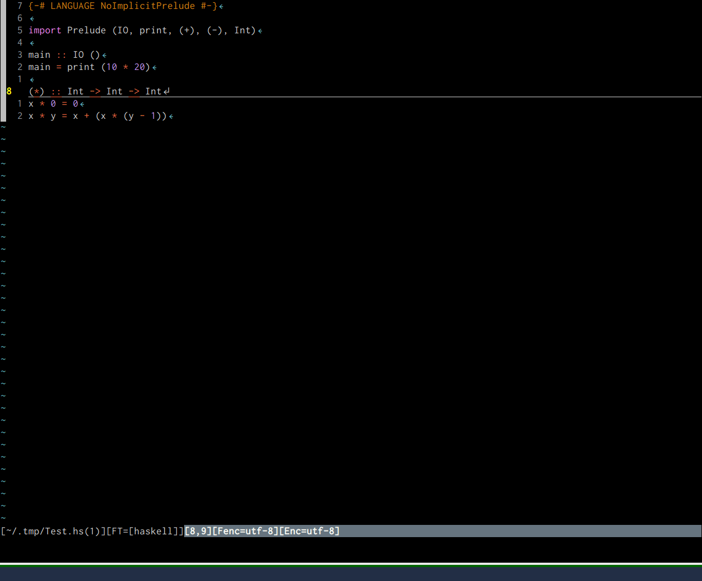

# :gift: vim-quickrepl :gift:

The **Simplest** Faster way to open your REPL for filetypes.

(like [vim-quickrun](https://github.com/thinca/vim-quickrun))

## VS reply.vim

reply.vim is another good way to open REPL.
But this focuses to synchronize REPL buffers and file buffers,
this often requires a configuration for unknown REPLs
(e.g. `stack ghci`).

vim-quickrepl focuses **simplicity** to configurate.
